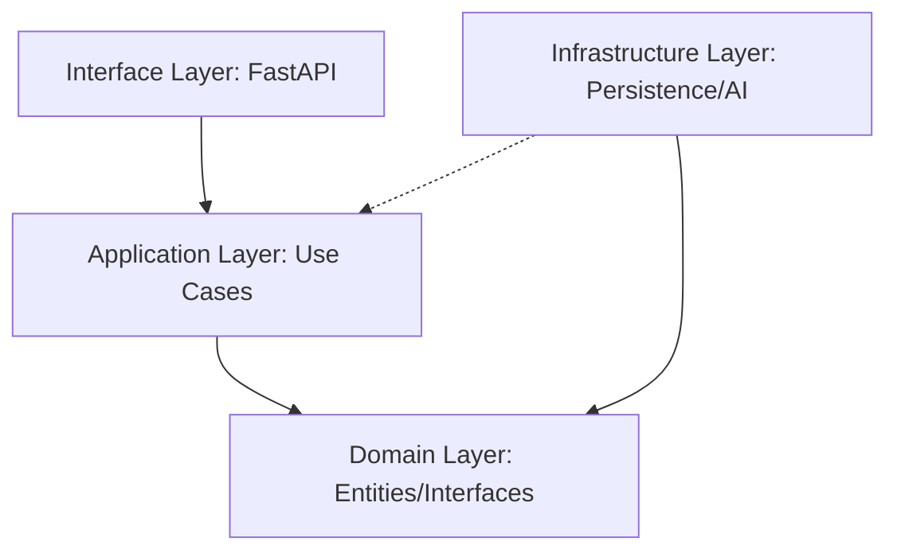

# Design: FastAPI & Clean Architecture

## Architecture Layers

### 1. Domain Layer (`src/advence_rag/domain/`)
- **Entities**: Core data structures.
- **Interfaces**: Protocol definitions for repositories and services.

### 2. Application Layer (`src/advence_rag/application/`)
- **Use Cases** (`use_cases/`):
    - Orchestration logic for Ingestion and Chat.

### 3. Infrastructure Layer (`src/advence_rag/infrastructure/`)
- **Persistence** (`persistence/`):
    - `hybrid_repository.py`: Combines Vector and Keyword search implementations.
- **AI** (`ai/`):
    - `agent_service.py`: Wrapper for LLM interactions (e.g., Gemini).
    - `reranker_service.py`: Reranking logic.
- **Parsers** (`parsers/`):
    - Document parsing implementations.

### 4. Interface Layer (`src/advence_rag/interfaces/`)
- **API v1** (`api/v1/`):
    - `chat.py`: OpenAI-compatible chat endpoints.
    - `ingest.py`: Document ingestion endpoints.
    - `schemas.py`: Pydantic models (DTOs).

## API Specification

### OpenAI Compatible (`/v1`)
- `POST /v1/chat/completions`: Main chat endpoint (handled in `chat.py`).
- `GET /v1/models`: List models.
- `POST /v1/embeddings`: Embedding generation.

### Custom Endpoints (`/api/v1`)
- `POST /api/v1/ingest/file`: Upload and ingest documents (handled in `ingest.py`).

## Dependency Injection
- Components are wired up in `main.py` or via FastAPI Dependencies, injecting Infrastructure implementations into Application Use Cases.
