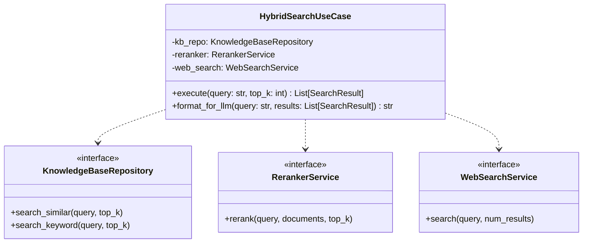

# Design: Unified Search Architecture

## Component Overview

### HybridSearchUseCase
The central orchestrator for retrieval. It implements a multi-stage pipeline:
1. **Retrieval**: Executes `KnowledgeBaseRepository.search_similar` and `.search_keyword` in parallel.
2. **Merging**: Deduplicates results based on ID.
3. **Reranking**: Uses `RerankerService` (Cross-Encoder) to re-score and re-order merged results.
4. **Evaluation**: Checks the top score against `CRAG_QUALITY_THRESHOLD`.
5. **Fallback**: If quality is low, triggers `WebSearchService`.
6. **Formatting**: Provides `format_for_llm()` to convert `SearchResult` entities into a structured summary for the LLM.

### Interfaces & Infrastructure
- **WebSearchService**: Abstract interface in domain.
- **SerperWebSearchService**: Implementation using Serper/Google tools.
- **CrossEncoderReranker**: Implementation updated to use async tool calls.

## Class Diagram

## Configuration
- `CRAG_ENABLED`: Boolean flag in `Settings` to toggle web search fallback.
- `CRAG_QUALITY_THRESHOLD`: Logit score (default 0.0) for Cross-Encoder evaluation.
